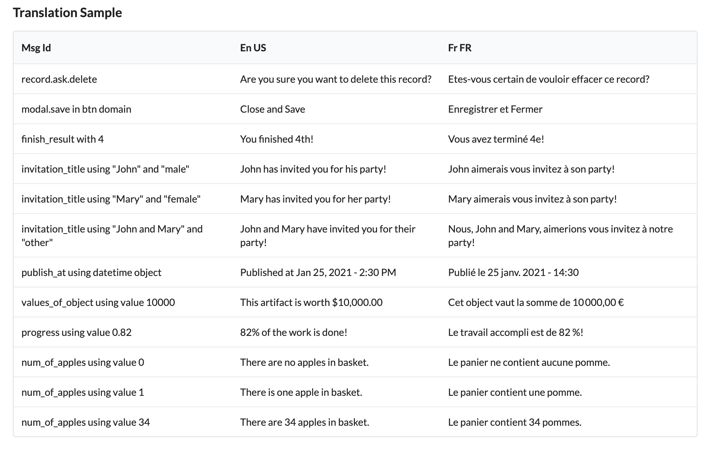

# Translation service for Atk4\Ui

Interface for Symfony\Translation component for Agile Toolkit Ui.



## Installation

```
composer require atk4/i18n
```

## Usage

### Initialisation

The translator need initializing.

```
use Atk4\I18n\Service;

Service::init($locale, $formatter, $cachePath, $cacheOptions, $clearCache);
```

#### string $locale 
The default locale use by the Symfony Translator.

#### MessageFormatterInterface $formatter

[optional] - You can supply your own formatter which comply to MessageFormatterInterface from Symfony.
When null, the symfony translation component will create one by default.

#### string $cachePath

[optional] - This will cache translation resources files at specify location. It is recomand to use for production as it will
speed up resource loading.

```
$cahePath = 'dir/to/caches'
```

#### array $cacheOptions

[optional] - Will generate caches files according to this option. A good usage
would be to specify caches for a translation version.

```
$caheOptions = ['version' => '1.0.0']
```

#### bool $clearCache

[optional] - Will clear caches files and regenerates resource file. For use in development. 

### Adding Resources files

Once translator has been initialized, add your translation resource files to it.

```
Service::addResource($path, $locale, $format);
```

#### string $path

The path to the directory where your resource files are located. In order to load
correctly, this directory must be organized per locale.

```
\- languages
    \- en
        \- messages.en.php
        \- messages+intl-icu.en.php
    \- en_US
        \- messages.en_US.php
        \- messages+intl-icu.en_US.php
    \- fr
        \- messages.fr.php
        \- messages+intl-icu.fr.php
    \- fr_FR
        \- messages.fr_FR.php
        \- messages+intl-icu.fr_FR.php
```

By specifing the languages path, the service will automatically load all resources
within the specified locale directory and file type format.

##### Important: 
Resource files name must follow this convention:
- default message: [domain].[locale].[format]
- ICU message: [domain]+intl-icu.[locale].[format]

#### string $locale

The locale directory to load file from.

#### string $format

The file format to load that is located inside the specified locale directory.

The service support file of type: php, yaml, po, csv, json, xlf, ini, mo, qt.

### The shortcut function _t().

The service expose a shortcut function in order to translate messages directly.

```
use function Atk4\I18n\Resource\_t;

echo _t($id, $param, $domain, $locale)
```

#### string $id

The id of the resource to translate.

#### array $param

[optional] - The parameter needed for translating the resource. Usually need for ICU message format.

#### string $domain

[optional] - The domain name. Default is 'messages'.

#### string $locale

[optional] - The locale name. Default is the one use in the service init method.

### The Translatable message T::class.

You may define certain messages to translate at a later stage using the 
translatable message `T::class`.

```
use Atk4\I18n\T;

// create translatable msg instance.
$msg = T::from($id, $param, $domain)
//...

// output $msg in specified locale when need.
echo $msg->in('fr_FR');
```

### Fallback locales

The symfony\translation component support fallback strategy for unavailable locale resources.

```
Service::addFallbackLocales(array $locales)
```

## More information

- [The Symfony\Translation component.](https://symfony.com/index.php/doc/current/translation.html)
- [The ICU message format](https://symfony.com/index.php/doc/current/translation/message_format.html)